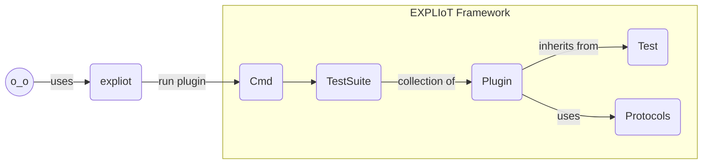

**EXPLIoT Framework Documentation**
___

Table of Contents

[TOC]

# Introduction
**EXPLIoT**

*noun*

/ɛkˈsplʌɪəti:/

A Framework for security testing and exploiting IoT products and IoT infrastructure. It provides a set of plugins (test cases) which are used to perform the assessment and can be extended easily with new ones. The name **EXPLIoT** *(pronounced expl-aa-yo-tee)* is a pun on the word **exploit** and explains the purpose of the framework i.e. IoT exploitation. It is developed in *python3*.

# License
EXPLIoT Framework is under GNU  AGPLv3 license.

# Author
EXPLIoT Framework is conceptualized, designed and implemented by Aseem Jakhar

Reach out: aseem  ___a__t___ expliot D0t io
* [Website](https://expliot.io)
* [LinkedIn](https://www.linkedin.com/in/aseemjakhar/)
* [Twitter](https://twitter.com/aseemjakhar)

# Installation
It is very simple to install. However, prior to installing EXPLIoT framework, you need to install the dependencies of some of the packages it uses.

Please follow the below steps to install expliot and its dependencies:

1. python3: Please install python3 on the system

2. *bluepy* python package dependency - *libglib2*

   `$ sudo apt-get install libglib2.0-dev`

3. *pyftdi/pyspiflash/pyi2cflash* python package dependency - *libusb*
   
   `$ sudo apt-get install libusb-1.0`

4. Copy the EXPLIoT git repo on your system

   `$ git clone https://gitlab.com/expliot_framework/expliot.git`

5. Go to the local repo

   `cd expliot`

6. Install EXPLIoT

   `$ sudo python3 setup.py install`

7. Voila! You are done.

# Thank you
* Computer pirates HDS ;)
* [null - The open security community](http://null.co.in)
* [Abhisek Datta](https://twitter.com/abh1sek)
* [Javier Vazquez Vidal](https://twitter.com/fjvva)
* [Milosch Meriac](https://www.meriac.com/)
* [Payatu Bandits](http://www.payatu.com/)
* [Hardwear.io Conference](https://hardwear.io/)
* [nullcon Conference](http://nullcon.net/)

# User Guide
Great! You have successfully installed EXPLIoT Framework. Now what?
To use the framework as a tool you can run the command line utility *expliot*.

## Running
There are two ways to run *expliot*: *command line mode* and *interactive mode*.
You can use whatever mode suits your requirements.

### Command line mode
Run the tool with command line arguments, it will execute the respective
command/arguments and exit. This is helpful for automation and
scripting different test cases as part of your testing: regression,
acceptance, security etc. The way you specify the command and arguments
is the same as *interactive mode*

#### Examples
* Run with help option
```
$ expliot -h
usage: expliot [-h] [cmd] ...

Expliot - Internet Of Things Security Testing and Exploitation Framework
Command Line Interface.

positional arguments:
  cmd         Command to execute. If no command is given, it enters an
              interactive console. To see the list of available commands use
              help command
  cmd_args    Sub-command and/or (optional) arguments

optional arguments:
  -h, --help  show this help message and exit
expliot@jaiho:~/Desktop/expliot/bin$ 
```
* EXPLIoT commands help

```
$ expliot help

Documented commands (type help <topic>):
========================================
alias  exit  help  history  list  macro  quit  run  set

$
```

* List all available plugins

```
$ expliot list
Total plugins: 23

PLUGIN                    SUMMARY
======                    =======

ble.generic.fuzzchar      BLE Characteristic value fuzzer
ble.generic.scan          BLE Scanner
ble.generic.writechar     BLE Characteristic writer
ble.tapplock.unlock       Tapplock unlock
can.generic.readcan       CANbus reader
can.generic.writecan      CANbus writer
coap.generic.get          CoAP GET
coap.generic.sample       Sample Summary
dicom.generic.c-echo      DICOM Connection Checker
dicom.generic.c-find      DICOM Data Finder
dicom.generic.c-store     DICOM File Store
i2c.generic.readeeprom    I2C EEPROM Reader
i2c.generic.writeeeprom   I2C EEPROM Writer
modbus.generic.readtcp    Modbus TCP Reader
modbus.generic.writetcp   Modbus TCP Writer
mqtt.generic.crackauth    MQTT authentication cracker
mqtt.generic.pub          MQTT Publisher
mqtt.generic.sub          MQTT Subscriber
spi.generic.readflash     SPI Flash Reader
spi.generic.writeflash    SPI Flash Writer
uart.generic.baudscan     Baud rate scanner for serial connection
uart.generic.fuzzcmds     Serial console command brute-forcer/fuzzer
udp.kankun.hijack         Kankun SmartPlug Hijacker
$ 
```

* Execute a plugin

```
$ expliot run coap.generic.sample -h
usage: coap.generic.sample [-h] -r RHOST [-p RPORT] [-v]

Sample Description

optional arguments:
  -h, --help            show this help message and exit
  -r RHOST, --rhost RHOST
                        IP address of the target
  -p RPORT, --rport RPORT
                        Port number of the target. Default is 80
  -v, --verbose         show verbose output
$
```

### Interactive mode
Run the the tool without specifying any command line arguments and you
will be greeted with a banner which shows the current version number,
name and finally the interactive console. You will now be able to run
individual plugins manually.

```
$ expliot 


                  __   __      _ _       _
                  \ \ / /     | (_)     | |
               ___ \ V / _ __ | |_  ___ | |_
              / _ \/   \| '_ \| | |/ _ \| __|
              | __/ /^\ \ |_) | | | (_) | |_
              \___\/   \/ .__/|_|_|\___/ \__|
                         | |
                         |_|


                         expliot
                    version: 0.5.0a1
                    version name: agni

                    Internet Of Things
             Security Testing and Exploitation
                        Framework

                     By Aseem Jakhar

            
ef>
```

To see the available commands on the console type *?* or *help* and press *enter*

```
ef> ?

Documented commands (type help <topic>):
========================================
alias  exit  help  history  list  quit  run  set  unalias

ef> help

Documented commands (type help <topic>):
========================================
alias  exit  help  history  list  quit  run  set  unalias

ef> 
```

## Plugins / Test Cases
The framework consists of various plugins which are either exploits or for recon, analysis etc. Each plugin executes a specific test case. These test cases are the basis of automation of security/regression testing for IoT products and infrastructure. The name of a plugin, as seen on the framework's console, is a *unique identifier* (ID) which identifies the plugin's capabilities and the target.

### Plugin IDs
___
The plugins are identified and categorized using their IDs and have a specific format. The IDs are unique within the framework. They are comprised of three components. 
1. Protocol or the technology it targets
2. Product that it targets
3. Name of the of the plugin itself that describes its action.

The format of the ID is `protocol.product.plugin_name`
For example, the ID of the BLE scanner plugin is `ble.generic.scan` Since it is a generic BLE scanner and not specific to any BLE product, the product component of the ID is *generic*.

## Commands
As of now there are only four commands defined in the framework. The other commands are from the cmd2 module and not used for the framework. These will be removed post beta version.
1. *exit* - To exit from the console.
2. *quit* - Same as *exit*
3. *list* -  to list down all the available plugins.
4. *run* - To run/execute a plugin.

**Note: All commands and plugins support tab completion. However, the plugin arguments, as of now, do not**

### exit command
___
As the name suggests, it is used to exit from the framework's console.
Example:
```
ef> exit
$
```
### quit command
___
It is the same as *exit* command.
Example:
```
ef> quit
$
```
### list command
___
This command lists down all the available plugins in the framework.
Example as of version 0.5.0a1:

```
ef> list
Total plugins: 22

PLUGIN                    SUMMARY
======                    =======

ble.generic.fuzzchar      BLE Characteristic value fuzzer
ble.generic.scan          BLE Scanner
ble.generic.writechar     BLE Characteristic writer
ble.tapplock.unlock       Tapplock unlock
can.generic.readcan       CANbus reader
can.generic.writecan      CANbus writer
coap.generic.get          CoAP GET
coap.generic.sample       Sample Summary
dicom.generic.c-echo      DICOM Connection Checker
dicom.generic.c-find      DICOM Data Finder
i2c.generic.readeeprom    I2C EEPROM Reader
i2c.generic.writeeeprom   I2C EEPROM Writer
modbus.generic.readtcp    Modbus TCP Reader
modbus.generic.writetcp   Modbus TCP Writer
mqtt.generic.crackauth    MQTT authentication cracker
mqtt.generic.pub          MQTT Publisher
mqtt.generic.sub          MQTT Subscriber
spi.generic.readflash     SPI Flash Reader
spi.generic.writeflash    SPI Flash Writer
uart.generic.baudscan     Baud rate scanner for serial connection
uart.generic.fuzzcmds     Serial console command brute-forcer/fuzzer
udp.kankun.hijack         Kankun SmartPlug Hijacker
ef> 
```


### run command
___
This is the main command that executes a plugin.
```
ef> run -h
usage: run plugin

Executes a plugin (test case)

positional arguments:
  plugin  The test case to execute along with its options
ef> 
```
**Executing a plugin**
___
To execute a plugin, you need to specify the plugin name and its arguments. All the plugins are well documented and to find out their description and arguments you need to specify the *help* argument (*-h* or *--help*) for the plugin.
We have an example plugin called *coap.generic.sample* within the framework, which can be used to study the code for a plugin and how one can write their own plugins. This is explained in detail in the **Development** section. Below you can see the output of the help argument of a plugin (using our sample plugin).

```
ef> run coap.generic.sample -h
usage: coap.generic.sample [-h] -r RHOST [-p RPORT] [-v]

Sample Description

optional arguments:
  -h, --help            show this help message and exit
  -r RHOST, --rhost RHOST
                        IP address of the target
  -p RPORT, --rport RPORT
                        Port number of the target. Default is 80
  -v, --verbose         show verbose output
```


Output of the BLE scanner plugin help argument:

```
ef> run ble.generic.scan -h
usage: ble.generic.scan [-h] [-i IFACE] [-t TIMEOUT] [-a ADDR] [-r] [-s] [-c]
                        [-v]

This test allows you to scan and list the BLE devices in the proximity. It can
also enumerate the characteristics of a single device if specified. NOTE: This
plugin needs root privileges. You may run it as $ sudo expliot

optional arguments:
  -h, --help            show this help message and exit
  -i IFACE, --iface IFACE
                        HCI interface no. to use for scanning. 0 = hci0, 1 =
                        hci1 and so on. Default is 0
  -t TIMEOUT, --timeout TIMEOUT
                        Scan timeout. Default is 10 seconds
  -a ADDR, --addr ADDR  Address of BLE device whose services/characteristics
                        will be enumerated. If not specified, it does an
                        address scan for all devices
  -r, --randaddrtype    Use LE address type random. If not specified use
                        address type public
  -s, --services        Enumerate the services of the BLE device
  -c, --chars           Enumerate the characteristics of the BLE device
  -v, --verbose         Verbose output. Use it for more info about the devices
                        and their characteristics
ef> 
```

# IoT Attack Surface
IoT is a combination of different technologies and the attack surface is considerably large. A simple explanation of the attack surface is given here - https://payatu.com/iot-security-part-2-101-iot-attack-surface/.

## Coverage
There is obviously no silver bullet (read tool) that can cover(test) the whole IoT eco-system attack surface. Our aim with EXPLIoT is to reach as close as possible i.e. to cover as many IoT protocols, hardware platforms, products as possible. We will explain the coverage of the framework based on protocols and technologies including the what, why and how of each plugin.

### BLE
___
[Bluetooth Low Energy](https://en.wikipedia.org/wiki/Bluetooth_Low_Energy) (BLE) protocol is an integral part of the smart tech and used widely in home, lifestyle, healthcare and enterprise IoT products. Below are the plugins that are implemented:

#### ble.generic.scan
___
**Description**
```
ef> run ble.generic.scan -h
```
**More information**
This is a generic BLE scanner to get information about BLE peripherals in the vicinity. It performs three different operations:
1. Scan for BLE peripherals around and show their BLE addresses.
2. Enumerate and show the services of a specific  BLE peripheral (specified by *-a or --addr*)
3. Enumerate and show the characteristics of a specific  BLE peripheral (specified by *-a or --addr*)

The *-v or --verbose* option shows more details in the output. Some peripherals may not connect if you have a PUBLIC addressing, in that case it is useful to specify *-r* or *--randaddrtype*.

**Note: This plugin requires root privileges to run as of now.**

#### ble.generic.writechar
___
**Description**
```
ef> run ble.generic.writechar -h
```
**More information**
This test is used to write values to a characteristic on a BLE peripheral, provided the device lets you write data on that specific characteristic. Which characteristic to write depends on your analysis of the available characteristics on the BLE peripheral. You can find the characteristics and their corresponding handle  using  *ble.generic.scan* plugin and analyse the BLE communication between the mobile app and the device to identify which characteristic is used for what and what are the valid values that you can write to it. To execute this test, you need to specify the BLE address of the device using *-a* or *--addr* argument and the characteristic handle using *-n* or *--handle* argument.  You may use *-s* or *--noresponse* argument if it does not respond with a write request. The *-r* or *--randaddrtype* can be used if the device does not respond, as described above in *ble.generic.scan* 

#### ble.generic.fuzzchar
___
**Description**
```
ef> run ble.generic.fuzzchar -h
```
**More information**
This test is very interesting and the idea came to us while pentesting a BLE device. Given, the capability to write data to characteristics, we can also automate and fuzz the values. These semantics of these values are defined by the developers and may be prone to memory corruption. We have tested this on a few devices and found different results from crash, display changes to DFU mode enable etc. Most of the arguments are the same as *ble.generic.writechar*. The *-i* or *--iter* is the no. of iterations of writes that you want to do and the *-w* or *--value* which is the value you want to fuzz, you will have to replace the bytes that you want to fuzz with *xx* and only those bytes will be randomized for each iteration.

#### ble.tapplock.unlock
___
**Description**
```
ef> run ble.tapplock.unlock -h
```
**More information**
This is an exploit for Tapplock, a BLE and fingerprint based door Lock. It is a commercially available product that you can purchase from the vendor's website or other famous e-commerce portals. The affected versions have two different implementations for generating the auth code to unlock i.e. either default hardcoded using *-d* or *--default* argument or generate it from the BLE address of the lock.

**Note: This plugin requires root privileges to run as of now as it needs scan capabilities.**

### CAN
___
[Controller Area Network](https://en.wikipedia.org/wiki/CAN_bus) (or CAN Bus) is a robust hardware communication protocol primarily used in vehicles. Other noted uses are in Industrial automation, Building automation, elevators etc. CAN hacking has really caught up due to advancements in automotive technology or in business terms introduction of IoT in automotive. Hence, it makes sense to have test case for security researchers to be able to analyse CAN enabled devices.

#### can.generic.readcan
___
**Description**
```
ef> run can.generic.readcan -h
```
**More information**
This test reads and shows the data on the CANBus. It uses [socketcan](https://en.wikipedia.org/wiki/SocketCAN) as of now. You need to have a CAN interface on your pc which is connected to the CANBus or for testing you can use a simulator and [configure](https://en.wikipedia.org/wiki/SocketCAN) a virtual can interface. In future version, we will add more capabilities and support for interfacing with different CAN analysis hardware. 

#### can.generic.writecan
___
**Description**
```
ef> run can.generic.writecan -h
```
**More information**
This test writes data on the CANBus. It uses [socketcan](https://en.wikipedia.org/wiki/SocketCAN) as of now. You need to have a CAN interface on your pc which is connected to the CANBus or for testing you can use a simulator and [configure](https://en.wikipedia.org/wiki/SocketCAN) a virtual can interface. In future version, we will add more capabilities and support for interfacing with different CAN analysis hardware. 

### CoAP
___
[Constrained Application Protocol](https://en.wikipedia.org/wiki/Constrained_Application_Protocol) (CoAP) is a light weight network communication protocol used for constrained devices. It is an IETF standard defined in [RFC 7252](https://tools.ietf.org/html/rfc7252) and is used in various IoT products. 

#### coap.generic.get
___
**Description**
```
ef> run coap.generic.get -h
```
**More information**
This test is not implemented yet. It will be added soon.

#### coap.generic.sample
___
**Description**
```
run coap.generic.sample -h
```
**More information**
This is just a sample plugin. It is intended for developers to understand the structure of a plugin class and how to implement one. 

**Note: This plugin does not do anything. Stay away.**

### DICOM
___
[Digital Imaging and Communications in Medicine](https://en.wikipedia.org/wiki/DICOM) (DICOM) is a healthcare standard for communication and management of patient information. It is used in various medical equipment to store and share image, patient data etc. If you are into medical security research the plugins will help you in testing the security of these devices.

#### dicom.generic.c-echo
___
**Description**
```
ef> run dicom.generic.c-echo -h
```
**More information**
This test is basically used to check if you can connect to a DICOM server and get information about the software used as well. If you are not familiar with DICOM, you can go through [this tutorial](http://dicomiseasy.blogspot.com/2011/10/introduction-to-dicom-chapter-1.html) which explains the basics and essentials of the protocol. 

#### dicom.generic.c-find
___
**Description**
```
run dicom.generic.c-find -h
```
**More information**
This test allows you to query data from the DICOM server. The protocol does not specify any authentication process. The authentication for CFIND is typically based on:
1. Cllent IP - You can't do much about this, unless there is another way to extract that information or test from local network and hope there is no IP restriction :smiley:
2. Client port - Can be specified using *-q* or *--lport* argument
3. Called AET (server) - Can be specified using *-s* or *--aetscp* argument


### I2C
___
[Inter-Integrated Circuit](https://en.wikipedia.org/wiki/I%C2%B2C) (I2C) is a synchronous, serial hardware bus communication protocol used for intra-board (short distance) communication i.e. between two components on a circuit board. It is a *2-wire* bus. It is also used in EEPROMs for example to read and write data.

#### i2c.generic.readeeprom
___
**Description**
```
ef> run i2c.generic.readeeprom -h
```
**More information**
The current implementation is dependent on *pyi2cflash* package which in turn is dependent on *pyftdi* package. Note that there will be some extra info printed on the console, when the plugin executes, which comes from the *pyi2cflash* package and is not part of the plugin code. To interface your PC with the I2C EEPROM chip, you need a hardware connector or bridge. You can use any FTDI based device, that provides an I2C interface. We have created a multi-protocol connector called **EXPLIoT Nano** which is available at our online store on https://expliot.io. Although, the framework should work with any *pyftdi* compatible FTDI device.

#### i2c.generic.writeeeprom
___
**Description**
```
ef> run i2c.generic.writeeeprom -h
```
**More information**
Similar considerations as *i2c.generic.readeeprom*

### MODBUS
___
[Modbus](https://en.wikipedia.org/wiki/Modbus) is a serial communication protocol used in ICS (Industrial Control Systems)  infrastructure, typically be devices like PLCs etc. Modbus is still an integral part of ICS and in your IoT assessments for Smart ICS infrastructure (Industry 4.0) you may still encounter devices talking Modbus. 

#### modbus.generic.readtcp
___
**Description**
```
run modbus.generic.readtcp -h
```
**More information**
This plugin reads coil, register values from a Modbus server running over a TCP/IP network. 

#### modbus.generic.writetcp
___
**Description**
```
ef> run modbus.generic.writetcp -h
```
**More information**
This plugin writes coil, register values to a Modbus server running over a TCP/IP network. 

### MQTT
___
[Message Queuing Telemetry Transport](https://en.wikipedia.org/wiki/MQTT)(MQTT) is a messaging protocol based on publish-subscribe mechanism and works over TCP/IP protocol stack. It is an ISO standard - [ISO/IEC 20922:2016](https://www.iso.org/standard/69466.html). You can also read the specification [here](http://mqtt.org/documentation). It is a very famous protocol in the IoT scene and is used in various domains from Home to ICS.


#### mqtt.generic.crackauth
___

**Description**
```
ef> run mqtt.generic.crackauth -h
```
**More information**
You should use this plugin if the broker requires authentication. You can  brute-force the credentials.
**Note: client ID and user name are not the same.**

#### mqtt.generic.pub
___
**Description**
```
ef> run mqtt.generic.pub -h
```
**More information**
During your assessment, you may want to write malicious data to a specific topic, check if you are able to write to specific topics, corrupt $SYS topics' data. This plugin can help you with that.

#### mqtt.generic.sub
___
**Description**
```
ef> run mqtt.generic.sub -h
```
**More information**
It is very common to check what topics we can subscribe to, what data do we receive for further analysis or get data from $SYS topics. If you are lucky you may end up reading sensitive data that can help you pwn the system. This simple plugin can help you in doing that.

### SPI
___
[Serial Peripheral Interface](https://en.wikipedia.org/wiki/Serial_Peripheral_Interface) (SPI) is a synchronous, serial hardware bus communication protocol used for intra-board (short distance) communication i.e. between two components on a circuit board. It is a *4-wire* bus. The communication is *full-duplex* as it has separate lines for master-to-slave and slave-to-master communication. In many devices, you may encounter flash memory chips, for example, that talk over SPI for data read/write and you may need a way to extract data from the chip for further analysis or write malicious data to the chip. 

#### spi.generic.readflash
___
**Description**
```
ef> run spi.generic.readflash -h
```
**More information**
The current implementation is dependent on *pyispiflash* package which in turn is dependent on *pyftdi* package. Note that there will be some extra info printed on the console, when the plugin executes, which comes from the *pyspiflash* package and is not part of the plugin code. To interface your PC with the SPI flash chip, you need a hardware connector or bridge. You can use any FTDI based device, that provides an SPI interface. We have created a multi-protocol connector called **EXPLIoT Nano** which is available at our online store on https://expliot.io. Although, the framework should work with any *pyftdi* compatible FTDI device.

#### spi.generic.writeflash
___
**Description**
```
ef> run spi.generic.writeflash -h
```
**More information**
Similar considerations as *spi.generic.readflash*

### UART
___
[Universal Asynchronous Receiver/Transmitter](https://en.wikipedia.org/wiki/Universal_asynchronous_receiver-transmitter)(UART) is not a hardware bus protocol, but a physical circuit that is used for serial communication between two components. The speed (baud rate) and data format are configurable, as the communication is asynchronous. UART is one of the most famous mechanisms for devices to have an interface with the outside world. Typically, a shell or a console runs over the UART port, so developers, support staff can access the running device for troubleshooting etc. It is a very interesting opportunity, from a security perspective, to gain access to a UART port and be able to interact with a console or read data on the connection. 

#### uart.generic.baudscan
___
**Description**
```
ef> run uart.generic.baudscan -h
```
**More information**
Since, the communication is asynchronous, the baud rate/format must be pre-configured for the two UART devices to talk to each other. There are some well-known baud rates that are usually used. However, if you don't know the correct baudrate for communication, you will end up with garbage data due to a mismatch on baud rate at both the ends. Hence, to analyse a UART port, we still need to know the correct baud rate of the device. This plugin just enumerates over different baud rates and analyses the received data for valid ASCII characters to identify the correct baud rate of the UART port on the device. You will need a USB UART converter to enable your PC to talk to the device UART port. There are many connectors available in the market. We have created a multi-protocol (including UART) connector called **EXPLIoT Nano** which is available at our online store on https://expliot.io. Although, the framework should work with any *Linux* compatible USB-UART connector (also called USB-TTL).

#### uart.generic.fuzzcmds
___
**Description**
```
ef> run uart.generic.fuzzcmds -h
```
**More information**
When the devices have a custom console running on a UART port, this plugin can help you in identifying undocumented or hidden console commands as well as fuzz commands and their arguments. We have been able to crash as well as find hidden commands using the same technique. The basic idea behind this plugin is that the console with respond with different output for valid and invalid commands or their parameters and given the knowledge of a valid output you can fuzz/brute-force the commands. It allows you to specify a character set  (*-c* or *--chars* argument) and length (*-l* or *--length*) to generate random strings which it sends to the device and analyses the response. You can also specify a match criteria string (*-m* or *--match*) which means that it will be considered as a valid response if the response contains this string. Alternatively, you can also specify a no-match criteria string (*-n* or *--nomatch*) which will tell the plugin to ignore the response and treat it as invalid if the response contains this string. To fuzz specific parts of the commands string you can specify a prefix string (*-x* or *--prefix*) and an append string (*-a* or *--append*) which are prefixed and appended to the generated fuzz string and then sent to the device UART. You may need to toggle and play around with *-t* or *--timeout* and *-z* or *--buffsize* arguments for optimum speed execution and then use the best values for the final fuzzing. Note that printing on the terminal will make the execution slow, so avoid *-v* or *--verbose* option for the final execution. The *-v* option comes handy when you just start analyzing the responses.

### UDP
___
As of now all, UDP based proprietary communication will be grouped here. Eventually, it will be changed to something else.

#### udp.kankun.hijack
___
**Description**
```
ef> run udp.kankun.hijack -h
```
**More information**
This is an exploit for a Smart plug called Kankun, manufactured by a Chinese vendor ikonke.com. It is out of production now. 


# Developer Guide
EXPLIoT Framework is a brilliant choice for vendors, smart infrastructure admins, developers and security researchers for various reasons:
1. It will streamline your security/regression testing
2. You will be able to identify security loopholes prior to deployment on an IoT solution in your infrastructure.
3. It will help you in automating time consuming test cases.
4. If you fall under any compliance or regulatory requirements for the IoT product or Smart Infrastructure, it will help you in automating and performing compliance checks regularly.
5. It will save a lot of time during IoT security research or assessments
6. You can mold it to your needs by simply extending it with your own plugins.

If you are interested in extending the framework i.e. writing new plugins, follow on :smiley:

## History
I started dreaming about an IoT vulnerability scanner way back in 2014. My idea was to automate the painful parts of an IoT penetration test. I figured that in our pen-tests, we were wasting a lot of time in setting up the test case environment and trying out different tools for specific purposes. Some tools were new, some were incomplete, buggy, some were proprietary with the hardware. After a while, we ended up writing our own scripts. Also, the nature of the IoT pentest projects is such that no two projects will be the same, today you might be pentesting a fleet management device and tomorrow you will get to test a smart vacuum cleaner or a gas sensor or something else, all of which have completely different use cases and physical interfaces i.e. attack surface. So, I started conceptualizing and implementing a framework that can encompass different functionality for an IoT pentest. I chose ruby as a language for implementing it as it is quite flexible. During the development, I realized that there was not much support for hardware and radio interfacing in ruby. The first version was written in ruby and after a lot of thought and stress I decided to rewrite it in python3. The current version is obviously in python3 :smiley:. 

## Design Goals
I had three major design goals for the framework:
1. It should be simple to use.
2. It should be extendable.
3. It should be easy to write new plugins (test cases).

## Architecture
The architecture, as of now, is kept very simple. I assume as we include new functionality it may become slightly complex. I would like to think it is sufficiently object-oriented and component based. The below diagram explains the major components of the framework which are explained in detail component wise. Some design considerations are:
1. There should be no external dependency for a plugin except for core python functionality which comes with the standard installation.
2. All the protocol, interface etc. implementation must reside within the framework and is utilized by the plugins.


## Unified Interface
I have created a unified interface for the plugins so they can utilize everything from within the framework. The benefits are:
1. No external dependency
2. Internal implementation may change at any time, but the framework wrapper classes and methods defined in the framework will remain same so plugins will not require any code changes.

This is only true for external package. Anything that is part of [*the python standard library*](https://docs.python.org/3/library/index.html) can be used freely i.e. imported and used directly by the plugins.

## Coding style
Please follow the below coding style, when writing new code, if you are used to some other style.

1. Class names should be short, simple and define the purpose. It **must** be in [*CamelCase*](https://en.wikipedia.org/wiki/Camel_case).
2. The method names **must not** use [*CamelCase*](https://en.wikipedia.org/wiki/Camel_case). It may use underscores ("\_") for a name with more than one word.
3. Class member names should follow the same convention as method names.
4. More to come soon.  

## Contribute
If you are interested in contributing to the project. Please follow these steps:
1. You must have an idea or a bug fix.
2. If this is your first time contributing to EXPLIoT, then please DO NOT submit
a pull/merge request first thing. Instead please open an
[issue](https://gitlab.com/expliot_framework/expliot/issues/new) describing your code changes.
3. You will need to sign a contributor license agreement. Please sign, scan and email the same.
4. Send the merge request.


## Bin
**Module Directory**
`bin`

This module contains the executable scripts for the framework.

### [expliot](bin/expliot)
___
This script starts the console for the user. It just initializes the [`Cli` class](expliot/core/ui/cli/__init__.py) as explained in the *ui* section below. The components of the script are:
1. `class EfCli()` - It is responsible for running the Cli.
    1. Methods:
        1. `main(cls)` - Class method that starts the command loop.
    2. Members:
        1. `banner` - The EXPLIoT intro banner
        2. `cli` - Object of the [`Cli` class](expliot/core/ui/cli/__init__.py) 

## Core
**Module Directory**
`expliot/core`

The core of the framework provides all the functionality and object definitions required by the plugins. It contains all the modules that make up the framework. 

### Common
___
**Module Directory**
`expliot/core/common`

This module contains the common utility methods and classes that perform generic/common tasks. As of now there is not much functionality in this module. Going forward all generic/repeated tasks will be added here. The current packages include:

1. `exceptions.py` - All framework specific exceptions will go here.
    1. `sysexcinfo()` - Used by plugins for logging any internal exception that is not specifically handled by the plugin itself.

2. `fileutils.py` - All file based utility methods will go here.
    1. `readlines_both(file1, file2)` - Unused as of now. This method reads two files and yields each line from the second file for each line in the first file. Good for user and password enumeration/dictionary.

### Interfaces
___
**Module Directory**
`expliot/core/interfaces`

These are interface modules for any external hardware connected to the system. This can be utilized internally by protocols module for interfacing and communicating with the hardware.

#### ftdi
___
**Module Directory**
`expliot/core/interfaces/ftdi`

This module is an interface for any [Future Technology Devices International(FTDI)](https://en.wikipedia.org/wiki/FTDI) device connected to the system. It is a wrapper over *pyspiflash* and *pyi2cflash* which internally depend on the *pyftdi* package. Currently, it is utilized by *protocols.hardware.spi* and *protocols.hardware.i2c* modules.

`__init__.py` - The wrapper implementation for the interface. The details of classes and methods are given below.

1. `class SpiFlashManager(SerialFlashManager)` - A wrapper over *pyspiflash SerialFlashManager*. More details can be found at https://github.com/eblot/pyspiflash
    1. `close(device)` - Static method. Calls terminate() on SpiController (in *pyspiflash*) to release the resource.

2. `class I2cEepromManager(SerialEepromManager)` -  A wrapper over *pyi2cflash SerialEepromManager*. More details can be found at https://github.com/eblot/pyi2cflash
    1. `close(device)` - Calls terminate() on the *I2cController* (in *pyi2cflash*) to release the resource.

### Protocols
___
**Module Directory**
`expliot/core/protocols`

This module is the home for all the different protocol implementations. All plugins are strictly required to import protocol specific functionality from here and not import from any other package outside of the framework. The protocols are grouped into submodules based on their usage and implementation:
1. *protocols.hardware* - Home for all hardware specific protocols
2. *protocols.internet* - Home for all TCP/IP based protocols
3. *protocols.radio* - Home for all radio specific protocols

**Important Note: As per the unified Interface mentioned above, even though an EXPLIoT dependency package is installed, DO NOT import it in your plugins. All protocol imports *must* be from this module**

#### protocols.hardware
___
**Module Directory**
`expliot/core/protocols/hardware`

All the hardware based protocol implementations go inside this module. 

##### CAN
___
**Module Directory**
`expliot/core/protocols/hardware/can`

The CAN implementation, currently, is a wrapper over *python-can* package.

`__init__.py` - The CAN wrapper implementation over *python-can*. The details of classes, methods etc. are given below.
1. `class CanBus(Bus)` - Wrapper over *python-can* Bus class.
2. `class CanMessage(Message)` - Wrapper over *python-can* Message class.

**Note: If any other *python-can* class, method etc. is required for a plugin, it *must* be added here.**

##### I2C
___
**Module Directory**
`expliot/core/protocols/hardware/i2c`

The I2C implementation, currently, is a wrapper over *pyi2cflash* package. The details of classes, methods etc. are given below.
1. `__init__.py` - It just imports *I2cEepromManager* class from *expliot.core.interfaces.ftdi* module, which can be used to interact with an FTDI device for I2C communication.

**Note: If any other *pyi2cflash* class, method etc. is required for a plugin, it *must* be added in *expliot.core.interfaces.ftdi* and then imported in to this module.**

##### SERIAL
___
**Module Directory**
`expliot/core/protocols/hardware/serial`

The SERIAL implementation, currently, is a wrapper over *pyserial* package. The details of classes, methods etc. are given below.
1. `__init__.py` - The serial wrapper implementation over *pyserial*. The details of classes, methods etc. are given below.
    1. `class Serial(Pserial)` - Wrapper over *pyserial* Serial class
        1. `readfull(self, bsize=1)` - reads *bsize* bytes of data from the serial connection.

**Note: If any other *pyserial* class, method etc. is required for a plugin, it *must* be added here.**

##### SPI
___
**Module Directory**
`expliot/core/protocols/hardware/spi`

The SPI implementation, currently, is a wrapper over *pyspiflash* package. The details of classes, methods etc. are given below.
1. `__init__.py` - It just imports *SpiFlashManager* class from *expliot.core.interfaces.ftdi* module, which can be used to interact with an FTDI device for SPI communication.

**Note: If any other *pyspiflash* class, method etc. is required for a plugin, it *must* be added in *expliot.core.interfaces.ftdi* and then imported in to this module.**

#### protocols.internet
___
**Module Directory**
`expliot/core/protocols/internet`

All the TCP/IP network based protocol implementations go inside this module. 

##### COAP
___
**Module Directory**
`expliot/core/protocols/internet/coap`

It is  not implemented yet but will be added soon.

##### DICOM
___
**Module Directory**
`expliot/core/protocols/internet/dicom`

The DICOM implementation, currently, is a wrapper over *pynetdicom* package. 
1. `__init__.py` - The DICOM wrapper implementation over *pynetdicom*. The details of classes, methods etc. are given below.
    1. `class AE(AppEntity)` - Wrapper over *pynetdicom* AE class.
    2. `class Dataset(DS)` - Wrapper over *pynetdicom* Dataset class.
    3. Constants/variables Imported - `VerificationPresentationContexts, QueryRetrievePresentationContexts, BasicWorklistManagementPresentationContexts` 

**Note: If any other *pynetdicom* class, method etc. is required for a plugin, it *must* be added here.**

##### MODBUS
___
**Module Directory**
`expliot/core/protocols/internet/modbus`

The MODBUS implementation, currently, is a wrapper over *pymodbus* package. Currently, Modbus over TCP is supported. The other communication methods will be supported soon.
1. `__init__.py` - The MODBUS wrapper implementation over *pymodbus*. The details of classes, methods etc. are given below.
    1. `class ModbusTcpClient(MBTClient)` - Wrapper over *pymodbus* ModbusTcpClient class.

**Note: If any other *pymodbus* class, method etc. is required for a plugin, it *must* be added here.**

##### MQTT
___
**Module Directory**
`expliot/core/protocols/internet/mqtt`

The MQTT implementation, currently, is a wrapper over *paho-mqtt* package. Currently, MQTT directly over TCP is supported. The other communication methods will be supported soon.
1. `__init__.py` - The MQTT wrapper implementation over *paho-mqtt*. The details of classes, methods etc. are given below.
    1. `class SimpleMqttClient()` - A simple client that implements basic mqtt communication methods.
        1. `pub(topic, **kwargs)` - Static method. Wrapper over *paho-mqtt subscribe.simple()* method.
        2. `pub(topic, **kwargs)` - Static method. Wrapper over *paho-mqtt publish.single()* method.
        3. `pubmultiple(msgs, **kwargs)` - Static method. Wrapper over *paho-mqtt publish.multiple()* method.
        4. `connauth(host, clientid=None, user=None, passwd=None, **kw)` - Checks if a client can connect to a broker with specific client id and/or credentials.
    2. `class MqttClient(Client)` - Wrapper over *paho-mqtt* Client class.

**Note: If any other *paho-mqtt* class, method etc. is required for a plugin, it *must* be added here.**

#### protocols.radio
___
**Module Directory**
`expliot/core/protocols/radio`

All the radio based protocol implementations go inside this module.

##### BLE
___
**Module Directory**
`expliot/core/protocols/radio/ble`

The BLE implementation, currently, is a wrapper over *bluepy* package. 
1. `__init__.py` - The BLE wrapper implementation over *bluepy*. The details of classes, methods etc. are given below.
    1. `class BleScanner(btle.Scanner)` - Wrapper over *bluepy* Scanner class.
    2. `class BlePeripheral(btle.Peripheral)` - Wrapper over *bluepy* Peripheral class.
    3. `class Ble()` - Implements the scan logic.
        1. `scan(iface=0, tout=10)` - Scans on a given BLE interface for a specified amount of time.

**Note: If any other *bluepy* class, method etc. is required for a plugin, it *must* be added here.**

### tests
___

All the test case related implementation like base test case classes, plugin management etc. goes here.

#### [test.py](expliot/core/tests/test.py)
___
This file has the interface definition for a test case. The plugins inherit from this base class. The details of classes, methods etc. are given below.

1. `class TCategory(namedtuple("TCategory", "proto, iface, action"))` - This class provides the definition for the category of a test case (plugin) which includes the protocol used, interface and action. For details refer the code documentation.
2. `class TTarget(namedtuple("TTarget", "name, version, vendor"))` - This class defines the target of the test case (plugin). The plugins can be generic or specific to an IoT product.
3. `class TResult()` - This class holds the status of a test case (plugin) i.e. fail, pass and the reason for failure.
    1. `setstatus(self, passed=True, reason=None)` - method used to set the status of a test.
    2. `exception(self)` - Set the failure status using the exception information as the reason.
4. `class TLog()` - Logger class that must be used by the plugins for logging any output. Plugins must not use any other print methods. You do not need to instantiate it, but just call *init()* to specify the output destination.
    1. `init(cls, file=None)` - Class method. Used to initialize the log to a file or *stdout*
    2. `close(cls)` - Class method. Close the file object if not *stdout*
    3. `success(cls, msg)` - Class method. Prints the *msg* with success ("*[+]*")  prefix.
    4. `fail(cls, msg)` -  Class method. Prints the *msg* with fail ("*[-]*") prefix.
    5. `trydo(cls, msg)` - Class method. Prints the *msg* with try ("*[?]*") prefix.
    6. `generic(cls, msg)` - Class method. Prints the *msg* with generic ("*[\*]*") prefix.
5.  `class Test` - The base class for a test case. The plugin **must** inherit from this class. It defines the basic functionality for defining and executing a plugin.
    1. **Methods:**
        1. `__init__(self, **kwargs)` - Plugin description initialization.
        2. `execute(self)` - The main plugin execution method. It is **mandatory** for the plugin to override this method.
        3. `pre(self)` - Any setup dependency logic for the plugin needs to be implemented here. It is optional for the plugin to override this method. Please **do not** implement argument parsing logic here, that needs to go in *execute()* method. As of now this method is not used by any plugins.
        4. `post(self)` - Any cleanup logic for the plugin needs to be implemented here. It is optional for the plugin to override this method. Please **do not** implement any success/fail logic here, that needs to go in *execute()* method.
        5. `intro(self)` - Prints plugin information when executed. Used internally for output. Plugin **must not** override this method.
        6. `run(self, arglist)` - Executes the `pre(), post(), execute()` and other required methods. This is used internally by the framework to execute the plugin logic. Plugin **must not** override this method.
    2. **Member objects:**
        1. `self.name` - The name of the plugin. 
        2. `self.summary` - Summary of the plugin. 
        3. `self.descr` - Description of the plugin. 
        4. `self.author` - Plugin author's name 
        5. `self.email` - Plugin author's email ID. 
        6. `self.ref` - *List* object containing reference URL(s) of the plugin 
        7. `self.category` - The category that the plugin belongs to. It is an object of `TCategory` class. This is defined by the plugin.
        8. `self.target` - The target of the plugin. It is an object of `TTarget` class. This is defined by the plugin.
        9. `self.needroot` - A Boolean value specifying whether the plugin needs root privileges or not. This is optional and needs to be defined by the plugin only if it needs root privileges to execute.
        10. `self.id` - The unique ID of plugin. It is generated by `self.category, self.target and self.name` in `_setid(self)` method.
        11. `self.argparser` - *argparse.ArgumentParser* object that contains the arguments of the plugin.
        12. `self.result` - Stores the pass/fail result of the plugin. It is an object of `TResult` class.
        13. `self.args` - Stores the values of the plugin arguments. It is a `namespace` object and is created by `parse_args()` method from `argparse` in `run(self, arglist)` method of `Test` class. The plugin code can use this to get the values of its arguments. More details on [`parse_args()` can be found here](https://docs.python.org/3/library/argparse.html#argparse.ArgumentParser.parse_args).

#### [testsuite.py](expliot/core/tests/testsuite.py)
___
This file implements the collection to manage the plugins. This is used by both *list* and *run* commands.

1. `class TestSuite(dict)` - This class basically imports all the plugin classes holds all the plugin IDs. It is instantiated by the `Cli` object and used for loading and executing the plugin requested by the user.
    1. `__init__(self, pkgname='expliot.plugins')` - Loads all the plugins. It internally calls `import_plugins()` to do the dirty work.
    2. `import_plugins(self, pkgname)`- Imports the plugins recursively from `pkgname` package.

### ui
___
**Module Directory**
`expliot/core/ui`

This is the home for all the different user interface implementations for the framework. As of now, we just have a command line interface for the framework.

#### cli
___
**Module Directory**
`expliot/core/ui/cli`

This module is currently built over [`cmd2`](https://cmd2.readthedocs.io/en/latest/) python package for creating and managing the Command line interface.
Refer the code in [expliot/core/ui/cli/__init__.py](expliot/core/ui/cli/__init__.py) for more details.
This file has the code for the Cli as of now.
1. `class Cli(Cmd)` - The main class that implements the [`cmd2`](https://cmd2.readthedocs.io/en/latest/) cli logic. It loads all the plugins using the `tsuite` member object of class [`TestSuite`](expliot/core/tests/testsuite.py).
    1. `__init__(self, prompt=None, intro=None)` - The constructor of the class. This is used for initializing *cmd2* members.
    2. `del_defaultcmds(self)` - This method removes the [`cmd2`](https://cmd2.readthedocs.io/en/latest/) default commands that come along with it as we do not want to show it in [`expliot`](bin/expliot).
    3. `do_list(self, args)` - This callback method implements the *list* command in [`expliot`](bin/expliot).
    4. `do_run(self, arglist)` - The callback method implements the *run* command in [`expliot`](bin/expliot).
    5. `complete_run(self, text, line, start_index, end_index)` - This callback method implement the TAB completion of plugin names in the *run* command.
    6. `runtest(self, name, arglist)` - This method is internally called by `do_run()` and calls the `run()` method of the plugin object.  
    7. `Cmd.do_exit` - This is an alias defined for `Cmd.do_quit` method provided by default in [`cmd2`](https://cmd2.readthedocs.io/en/latest/)

##### Adding a new command
___
To add a new command, we need to implement a callback method in [`Cli`](expliot/core/ui/cli/__init__.py) class as we have done for *run* and *list* commands. As per [`cmd2` documentation](https://cmd2.readthedocs.io/en/latest/) to add a new command, you need to implement a callback method in your code and the method name should be of the format `do_commandname()`. For example, to add a command *foobar* we will implement a callback method `do_foobar()`. 

## Plugins (Test Cases)
Plugins are classes that inherit from *Test* base class and implement a specific test case which can be an exploit, analysis, recon, fuzzer etc. To extend the framework one can implement any no. of plugins. 

### Sample Plugin *coap.generic.sample*
___
There is already a sample plugin implemented in the framework [*coap.generic.sample*](expliot/plugins/sample.py) that explains the implementation *How tos* for a plugin. It would be better to open the code of the plugin now and then follow the below documentation.

**Note: The sample plugin does not do any operation. It is only implemented to show the features you can use to implement a plugin.

### Plugin Directory
___
**Module Directory**
`expliot/plugins`

This is the home for all the plugins that are implemented in the framework. Any new plugin file **must** be created in its corresponding directory within the `plugins` directory.
For example, any BLE based plugin will go in the directory `expliot/plugins/ble`. This is done to keep the directory structure clean and
help develoipers find the relevant plugins.

### Plugin sections
The implementation of a plugin can be divided into three parts:
1. Plugin information
2. Plugin Arguments
3. Plugin methods

If you are reading this I'm guessing you want to create a new plugin. Well, it is pretty simple to implement and add a new plugin to the framework. You just need to be ready with the idea, logic and arguments. If you need a specific protocol which is not part of the framework yet, just send us an email describing your requirement and the reason why you think that the protocol is important for IoT and needs to be added and we will add it to the framework, if it looks like an interesting protocol.

#### Plugin information
___
Plugin information can be thought of as an *About me* for the plugin which defines what category the plugin belongs to and what is the target of the plugin among other information. All this information goes in the `__init__()` method of the plugin as shown in the code below.

```
from expliot.core.tests.test import Test, TCategory, TTarget, TLog

class Sample(Test):
def __init__(self):
        super().__init__(name     = "Sample",
                         summary  = "Sample Summary",
                         descr    = "Sample Description",
                         author   = "Sample author",
                         email    = "email@example.com",
                         ref      = ["https://example.com", "https://example.dom"],
                         category = TCategory(TCategory.COAP, TCategory.SW, TCategory.EXPLOIT),
                         target   = TTarget(TTarget.GENERIC, TTarget.GENERIC, TTarget.GENERIC))
```
Let's look at each parameter:
1. `name` - This is the name of the plugin and is part of the plugin ID. Keep it short but descriptive about the action and **DO NOT** use white space in the name.
2. `summary` - Summary of the plugin. This is displayed in the *list* command 
`descr` - The description of the plugin. This is displayed when the plugin is run with the *-h* or *--help* argument. Please be as descriptive as possible assuming the user does not have much knowledge about the plugin and its features.
3. `author` - Plugin author's name
4. `email` - Plugin author's email ID
5. `ref` - A *list* containing one or more reference or source URLs containing either the exploit details or relevant information used as the basis of the plugin. 
6. `category` - The category of the plugin defined by TCategory's protocol, interface and action. For more details look at TCategory implementation in *test.py*
7. `target` The (vulnerable) target of the Plugin defined by  name, version and vendor as a TTarget object. If it is a generic plugin then use generic for all. We may start defining names and vendors in TTarget class itself for standardization.

**Other important parameters:**  
1. `needroot` - If the plugin needs root privileges, set this to *True*. **DO NOT** specify this if root privilege is not required. As of now, the framework checks if it has root privileges, if not it fails with the relevant message.

#### Plugin Arguments
___

The plugin can be configured to run based on the requirements. It is done via plugin arguments. For example, if a plugin needs to send payload to a server it needs to know the server host name/IP and the port. All these parameters can be assed with the arguments to the plugin. It is very simple to add and utilize the arguments within the plugin. The parsing logic for the arguments **must** be implemented in the `execute()` method. The argument implementation for EXPLIoT is based on python *argparse* module which is part of the [Python Standard Library](https://docs.python.org/3/library/). 

After we define the plugin information in the `__init__()` method (as shown above), we have to populate the arguments for the plugin (also in the `__init__()` method). The *Test* base calls defines an *argparse* object and initializes it in its `__init__()` method as shown below (from `expliot/core/tests/test.py`):
```
self.argparser = argparse.ArgumentParser(prog=self.id, description=self.descr)
```
For the *argument parser* in the framework the *self.id*  and *self.descr* of the plugin become the name and the description respectively. Now, let's look at how to add and use the arguments.

**Note: For more details on the API and how to use different methods like `add_argument()`, please refer [*argparse* documentation](https://docs.python.org/3/library/argparse.html).**

Below is an excerpt from the *coap.generic.sample* plugin.
```
from expliot.core.tests.test import Test, TCategory, TTarget, TLog

class Sample(Test):
    def __init__(self):
        super().__init__(name     = "Sample",
                         summary  = "Sample Summary",
                         descr    = "Sample Description",
                         author   = "Sample author",
                         email    = "email@example.com",
                         ref      = ["https://example.com", "https://example.dom"],
                         category = TCategory(TCategory.COAP, TCategory.SW, TCategory.EXPLOIT),
                         target   = TTarget(TTarget.GENERIC, TTarget.GENERIC, TTarget.GENERIC))

        self.argparser.add_argument("-r", "--rhost", required=True, help="IP address of the target")
        self.argparser.add_argument("-p", "--rport", default=80, type=int, help="Port number of the target. Default is 80")
        self.argparser.add_argument("-v", "--verbose", action="store_true", help="show verbose output")
```
We have already discussed the information parameters above, let's focus on adding arguments. To add an argument, you need to call the `add_argument()` method on the *argparser* object and pass the parameters as per the argument's requirement. You can add as many arguments as required by the plugin by invoking `add_argument()` method that many no. of times.
1. `"-r"` - First parameter is the single hyphen-character representation of the argument.
2. `"--rhost"` - Second parameter is the double hyphen-word representation of the argument.
3. `help="IP address of the target"` - Specify the help string. It is **mandatory** to fill this. This is displayed along with the argument when plugin is run with *-h* or *--help* argument.
4. `required=True` - Set the* required* parameter to *True* the argument is mandatory. If it is optional, no need to specify this option.
4. `default=80` - If you want you can specify a default value for an argument.
5. `type=int` - You can specify the data type of the argument value. If not, specified, default data type is a *string*.
6. `action="store_true"` - If an argument does not take any value. You can use this as a toggle to set the value of the argument to true (in this example) and decide your action based on whether the user specified this argument or not. As shown in the sample above it is used with the *verbose* argument.
7. For any other requirements, not covered here refer to [*argparse* documentation here](https://docs.python.org/3/library/argparse.htm).

**Conventions for arguments:**
1. Do not define *-h* and *--help* in the plugin as they are internally generated on the fly for help text of a plugin.
2. Prefer to define *-r* and *--rhost* for remote server hostname or IP.
3. Prefer to define *-p* and *--rport* for remote server port number.
4. Prefer to define *-l* and *-lhost* for local server hostname or IP.
5. Prefer to define *-q* and *--lport* for local server port number.
6. Prefer to define *-v* and *--verbose* when you require verbose output option.
7. Prefer to define *-a* and *--addr* for hardware addresses (MAC, BLE etc.).

#### Plugin methods
___
There are three methods defined in the *Test* base calls which the plugins will override for its execution. They are:
1. `pre(self)` - This is an optional method. Any dependency/setup related logic for the plugin will go here. Please **DO NOT** add argument parsing logic in this method, that must go in the *execute()* method. The plugin author does not need to override this otherwise. As of now none of the plugins implement this (well, actually there are a few plugins, but the code will be changed soon).
2. `post(self)` - This is an optional method. Any dependency/cleanup related logic for the plugin will go here. Please **DO NOT** add plugin fail/success logic in this method, that must go in the *execute()* method. The plugin author does not need to override this otherwise. As of now none of the plugins implement this (well, actually there are a few plugins, but the code will be changed soon).
3. `execute(self)` - This method is **mandatory** to be overridden by the plugin class. This is where the exploit etc. logic will go. At the end of the method you need to set the status of the test case, if it failed as explained below. Also, the plugin needs to use *TLog* class methods for logging any output.

### Result
___
The plugin's failure status or result (basically a Boolean and a message string) after execution needs to be determined and then set accordingly before returning from `execute()` method. The plugin does not need to set anything for successful execution. The status is stored in plugin's `self.result` object. There are two ways to set the status.
1. *Set specific message* - When you know the exact reason, you can set it using `self.result.setstatus(passed=False, reason="Whatever reason")
2. *Unknown/External Exception* - If there was an exception raised by another package and the plugin cannot handle all the cases, it can use `self.result.exception()` which basically sets the `reason` to the exception's message.

Refer [*coap.generic.sample*](expliot/plugins/sample.py) plugin's `execute()` method

**Note: It is mandatory to determine the fail criteria and call any of these methods in `execute()`.**

### Logging
___
All the logging within the plugin must use `TLog` class methods based on why/what is being logged.

Refer 
1. [`TLog`](expliot/core/tests/test.py)  class details for methods.
2. [*coap.generic.sample*](expliot/plugins/sample.py) plugin's `execute()` method for usage.

**Note: It is mandatory to use only `TLog` methods for logging. Please do not use any other python print style methods.**
